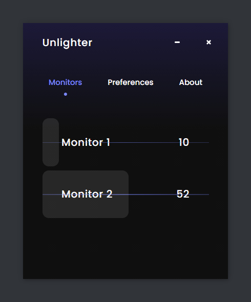

# Unlighter



Unlighter is a small and free software made to reduce the screens brightness lower than the minimum possible. It works with every type of screens.

## Download

You can download the latest version of Unlighter in the [Github Release tab](https://github.com/Dono7/Unlighter/releases).

---

## Development Setup

### Compiles and hot-reloads for development

First, clone the project :

```bash
git clone https://github.com/Dono7/Unlighter.git
cd unlighter
```

Then with Yarn (recommanded) : 

```bash
yarn install
yarn electron:serve
```


### Compiles and minifies for production

```bash
yarn build
```

