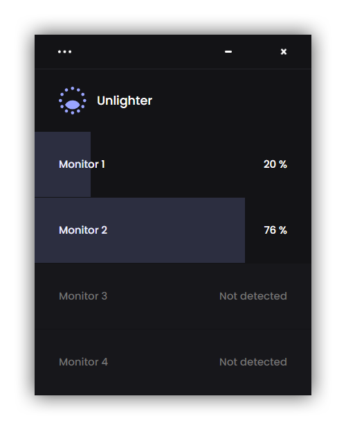

<p align="center">
	<a href="https://unlighter.app">
		
	</a>
</p>

<p align="center">
  <a href="https://unlighter.app/download">
    
  </a>
  <a href="https://unlighter.app/download">
    
  </a>
  <a href="https://unlighter.app">
    
  </a>
</p>

# Unlighter

Unlighter is a free software made to **reduce your screens brightness**. It works with every type of screens, and can dim the monitor beyong the built-in minimum. It also provides some shortcuts to easily control your brightness, and an auto-updater system.



## Download

_For the moment, Unlighter is only available on Windows._

You can download the latest version of Unlighter on the [Unlighter Download Page](https://unlighter.app/download). As the Unlighter is still new and does not have a large number of users, you may see different warning while downloading or installing the app.

You can also see all the previous versions on this page.

## Shortcuts

`Alt`+`F2` : Decrease filters strength by 5%

`Alt`+`F3` : Increase filters strength by 5%

## Contributors

- [Donovan T.](https://github.com/Dono7/) : Software Developer & Web Weveloper
- [Walid B.](https://www.behance.net/bourhanewac933) : UI/UX Designer

## Report a bug

If you encounter any problem, first of all, make sure you have the latest version. You can easily update the app from the Update tab.

If you are already up to date, then please [open an issue](https://github.com/Dono7/Unlighter/issues) on the Github section, if you want to report a bug. Provide as many details as you can, including the app version (displayed when the app starts or in the About tab of the app).

---

## Development Setup

_This may not work properly on iOs or Linux_

We use [electron-vue](https://nklayman.github.io/vue-cli-plugin-electron-builder/), a boilerplate for the [Vue CLI](https://cli.vuejs.org/). You can also refer to the official [Vue 3](https://v3.vuejs.org/) or [Electron](https://www.electronjs.org/docs/latest) docs.

### Compiles and hot-reloads for development

First, clone the project :

```bash
git clone https://github.com/Dono7/Unlighter.git
cd unlighter
```

Then with Yarn (recommanded) :

```bash
yarn install
yarn electron:serve
```

### Compiles and minifies for production

```bash
yarn electron:build
```
